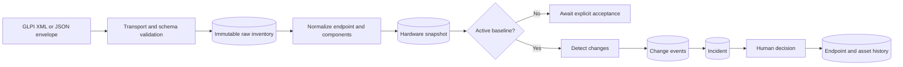
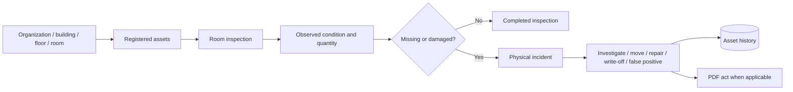
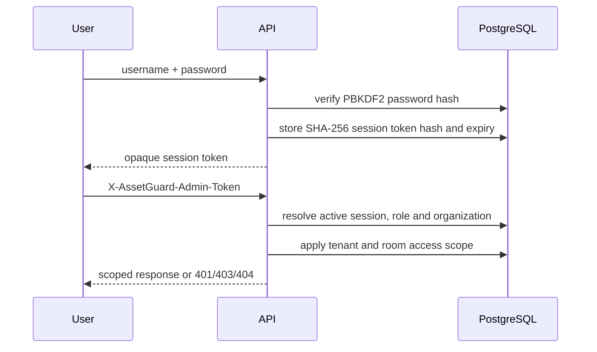

# Потоки данных

## Инвентаризация оборудования



1. `POST /glpi-agent` принимает нативный XML GLPI Agent по HTTP Basic. `POST /internal/inventories` принимает JSON bridge по shared secret.
2. Adapter приводит оба транспорта к внутреннему envelope. Ограничение JSON inventory по умолчанию — 2 MiB.
3. `ingest_raw_inventory` сохраняет payload, hash и transport metadata. Idempotency не допускает повторной обработки одного свидетельства.
4. Normalizer сопоставляет или создаёт managed endpoint, фиксирует identifiers и создаёт hardware snapshot с component observations.
5. Для полной инвентаризации сравнивается полный набор поддерживаемых компонентов. Частичный payload не создаёт ложные события удаления.
6. При наличии активного baseline change detector создаёт дедуплицированные events; incident workflow связывает их с разбором человеком.
7. Принятие нового baseline выполняется отдельным действием и записывается в историю.

## Физический учёт



Помещения принадлежат иерархии организации. Проверка фиксирует ожидаемые и фактические состояния активов. Для расхождений создаются физические инциденты; операции перемещения и списания обновляют актив и сохраняют историю. Для поддерживаемых операций формируется PDF-акт.

## AssetGuard Vision

1. Авторизованный пользователь отправляет JPEG или PNG, помещение и необязательный asset ID.
2. API проверяет тип, размер (по умолчанию до 10 MiB) и принадлежность помещения организации пользователя.
3. Grounding DINO загружается лениво и возвращает detections выше настроенного confidence threshold.
4. Оригинал и изображение с bounding boxes сохраняются в Vision storage; detections и scan metadata — в PostgreSQL.
5. Пользователь явно принимает scan как room baseline.
6. Следующий scan сравнивается с baseline по количеству распознанных классов и может получить статус `WARNING`.

Vision не подтверждает идентичность конкретного устройства и не заменяет аппаратную инвентаризацию.

## Аутентификация и авторизация



Bootstrap admin/viewer shared secrets проходят через тот же header, но не имеют named-user lifecycle. Agent traffic использует отдельные per-agent credentials с legacy shared-secret fallback.

## Восстановление Agent после переустановки Windows

```mermaid
sequenceDiagram
    participant Installer
    participant API
    participant Admin
    participant DB as PostgreSQL
    Installer->>API: SMBIOS UUID + hostname + installer version
    API->>DB: match active endpoint; store token hashes and 30-minute request
    API-->>Installer: request id + one-time claim token
    Admin->>API: approve tenant-scoped request
    API->>DB: revoke old active credential; create new hashed credential
    Installer->>API: poll with claim token
    API-->>Installer: approved + Agent username
    Installer->>API: GLPI inventory using username + claim token
```

UUID используется для сопоставления, но не считается секретом или самостоятельным доказательством владения устройством. Публичный create-response не раскрывает, найден ли endpoint. Claim token остаётся в памяти installer и хранится сервером только как SHA-256/PBKDF2 hashes. Неизвестный, чужой, отклонённый или просроченный запрос не меняет credentials. Одобрение сохраняет прежний endpoint и историю инвентаризации.

## Backup и восстановление

Windows- и Linux-скрипты формируют PostgreSQL dump, шифруют его контейнером AGBK1 (AES-256-GCM) и отправляют в Cloudflare R2. Restore rehearsal скачивает последнюю off-site копию, расшифровывает её и проверяет восстановление в отдельной базе. R2 upload/download/restore cycle успешно проверен 2026-09-27 через Windows Task Scheduler и постоянный Linux server; server rehearsal вернул `0024`, `assets=211`, `endpoints=1`. Vision image volume в этот backup не входит и требует отдельного решения до production-сбора фотографий.

## Инварианты

- Raw evidence не изменяется после приёма.
- Baseline меняется только явной операцией.
- События изменений имеют dedup key.
- Tenant-scoped запросы фильтруются по `organization_id`; доступ к помещениям дополнительно ограничивается grants.
- В каждый момент с endpoint связан не более чем один активный Agent credential; отозванные credentials сохраняются для аудита.
- Значимые изменения состояния отражаются в endpoint или asset history.
