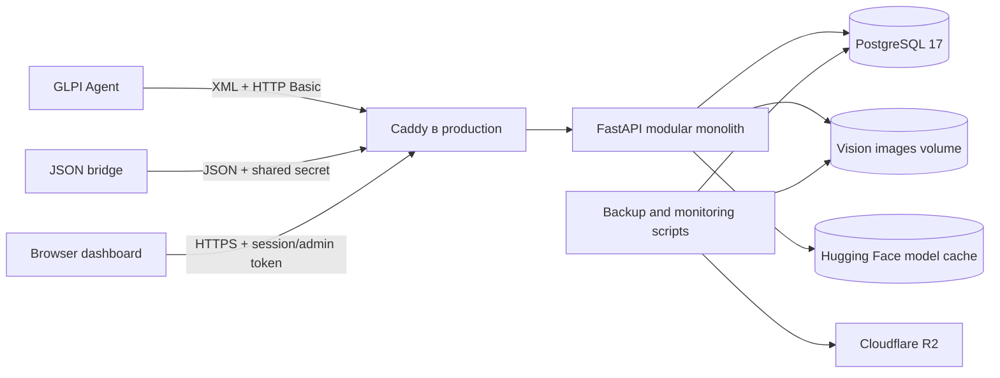

# Обзор архитектуры

## Назначение и границы

AssetGuard — модульный монолит для учёта компьютерных и физических активов. Система принимает инвентаризации GLPI Agent, сохраняет исходные свидетельства, строит нормализованные снимки, сравнивает их с явно подтверждённым baseline и ведёт инциденты и историю решений. Отдельный контур AssetGuard Vision сравнивает состав помещения по изображениям.

Проект не содержит собственного агента сбора, helpdesk или автоматического принятия решений о краже. GLPI Agent остаётся внешним сборщиком, а человек подтверждает baseline и решения по инцидентам.

## Контекст системы

В локальной разработке клиенты могут обращаться к FastAPI напрямую. В production публичным компонентом является Caddy; API и PostgreSQL находятся во внутренней Docker-сети.

## Основные компоненты

| Компонент | Ответственность | Реализация |
| --- | --- | --- |
| HTTP-интерфейсы | Health, authentication, ingestion, admin workflows и Vision API | `backend/src/assetguard/interfaces/http/` |
| Inventory | Проверка transport envelope и неизменяемое хранение raw payload | `modules/inventory/` |
| Endpoints и snapshots | Идентификация устройства, нормализация оборудования и контроль last-seen | `modules/endpoints/`, `modules/snapshots/` |
| Baselines и changes | Явное принятие эталона и детерминированное сравнение снимков | `modules/baselines/`, `modules/changes/` |
| Incidents и history | Инциденты, решения и журнал действий по активу или endpoint | `modules/incidents/`, `modules/history/` |
| Assets | Организации, здания, этажи, помещения, активы и физические проверки | `modules/assets/` |
| Identity | Пользователи, сессии, роли, Agent credentials, re-enrolment и доступ к помещениям | `modules/identity/` |
| Vision | Grounding DINO, scans, detections и room baseline | `modules/vision/` |
| Persistence | SQLAlchemy sessions и Alembic migrations | `infrastructure/database.py`, `backend/migrations/` |
| Web UI | Статический browser dashboard, смонтированный FastAPI | `frontend/`, `assetguard/app.py` |

Границы модулей организационные: приложение собирается в одном FastAPI-процессе и использует общую PostgreSQL-схему. Выбор модульного монолита зафиксирован в [ADR-001](../decisions/ADR-001-modular-monolith.md).

## Хранение данных

- PostgreSQL хранит доменные сущности, raw inventory, snapshots, события, инциденты, решения, сессии и метаданные Vision.
- Оригиналы и аннотированные изображения Vision хранятся в файловой системе. В production это volume `assetguard-vision-data`.
- Модель Vision кэшируется отдельно в `assetguard-model-cache`.
- Alembic является единственным подтверждённым механизмом изменения схемы; на момент этого документа цепочка включает migrations `0001`–`0025_agent_reenrolment`.
- Raw inventory, снимки и история являются свидетельствами; новый снимок не заменяет baseline автоматически.

## Развёртывание

Подтверждены четыре режима:

1. локальный backend с PostgreSQL из `docker-compose.yml`;
2. локальная публичная демонстрация через Cloudflare Quick Tunnel;
3. production Compose с Caddy, API и PostgreSQL;
4. Oracle Free overlay с ограничениями ресурсов и без Vision runtime.

Точки входа и ограничения собраны в [deployment](../deployment/README.md). Детальный путь данных описан в [data-flow.md](data-flow.md).

## Архитектурные ограничения

- In-process rate limiter рассчитан на один API-процесс и не является распределённым.
- Vision выполняет inference в API-процессе; отдельной очереди или background worker нет.
- Идентификация endpoint опирается на набор аппаратных идентификаторов и переводит конфликт в состояние, требующее проверки.
- Частичная инвентаризация не трактует отсутствующий компонент как удалённый.
- Bootstrap shared secrets сохранены для развёртывания и совместимости; основной пользовательский путь поддерживает named users и отзыв сессий.

Текущие ограничения и подтверждённый незакрытый техдолг перечислены в [technical-debt.md](../technical-debt.md).
