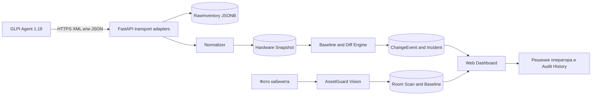

# AssetGuard — архитектура и сценарий питча

## Главная мысль

AssetGuard превращает технический отчёт об оборудовании в понятный управленческий процесс: **Agent увидел состав → система сравнила его с подтверждённым эталоном → создала объяснимый инцидент → человек принял решение**.

Система не называет любое изменение кражей. Она показывает доказательства и оставляет классификацию ответственному сотруднику.

## Как работает GLPI Agent

1. Неизменённый open-source GLPI Agent 1.19 запускается на Windows-компьютере вручную или по расписанию.
2. Privacy-профиль разрешает только нужные категории: BIOS, CPU, RAM, накопители, GPU, плата, мониторы и сетевые идентификаторы.
3. Agent формирует JSON/XML inventory и отправляет его в AssetGuard по HTTPS. Пользовательские документы, пароли, процессы и список пользователей не собираются.
4. AssetGuard сохраняет исходный отчёт как неизменяемое доказательство, нормализует компоненты и строит Snapshot.
5. Полный Snapshot сравнивается с явно подтверждённым Baseline. PARTIAL-отчёт не трактуется как исчезновение оборудования.
6. При расхождении создаются ChangeEvent и Incident. В интерфейсе оператор видит «Было → Стало», серийный номер и время.

Реальную инвентаризацию текущего компьютера можно показать командой:

```powershell
pwsh -File .\scripts\windows\send-minimal-inventory.ps1 `
  -GatewayUri http://127.0.0.1:8000/internal/inventories
```

## Воспроизводимый инцидент для питча

Перед презентацией выполните:

```powershell
pwsh -File .\scripts\windows\prepare-pitch-incident.ps1
```

Скрипт работает через те же API, что и Agent:

1. отправляет полный GLPI-совместимый снимок компьютера с двумя модулями RAM;
2. создаёт актив и связывает его с endpoint;
3. явно подтверждает первый снимок как эталон;
4. отправляет второй полный снимок без второго модуля;
5. получает настоящий `COMPONENT_REMOVED` и Incident из рабочего backend workflow.

Это контролируемая демонстрационная фикстура. На питче корректная формулировка: «Мы воспроизводим реальный класс события через тот же pipeline, которым обрабатываются отчёты установленного Agent», а не «мы только что физически украли память».

После выполнения обновите Dashboard. В блоке «Последний инцидент» нажмите **Открыть карточку и доказательства**. В карточке покажите:

- статус «Требует внимания»;
- RAM: один модуль вместо двух;
- сравнение «Было → Стало»;
- обращение и кнопки решения;
- хронологию: inventory → изменение → incident.

## Архитектура



### Слои проекта

| Слой | Технология | Ответственность |
| --- | --- | --- |
| Collector | GLPI Agent 1.19 + PowerShell profile | Локально получить разрешённый hardware inventory |
| Transport | FastAPI adapters | Принять native GLPI XML или доверенный JSON, проверить ключ и идемпотентность |
| Evidence | PostgreSQL JSONB | Неизменяемо сохранить исходный отчёт и его hash |
| Domain | Python services | Identity resolution, snapshots, completeness, baseline, diff, incidents |
| Application API | FastAPI admin endpoints | Assets, endpoints, решения, история, Vision |
| UI | HTML/CSS/JavaScript | Dashboard, карточки, доказательства и действия оператора |
| Vision | Grounding DINO | Посчитать объекты на фото и сравнить кабинет с визуальным эталоном |

Ключевой принцип архитектуры: transport может меняться, но оба входа приводятся к одному canonical inventory и проходят один domain workflow. Поэтому native GLPI Agent и JSON bridge не создают две разные бизнес-логики.

## Готовый спич на 4–5 минут

### 0:00–0:40 — проблема

> В организации десятки или сотни компьютеров, но факт нахождения конкретной памяти или SSD часто существует только в Excel или в момент ручной проверки. Если компонент заменили или изъяли, руководство узнаёт об этом слишком поздно. AssetGuard создаёт непрерывный цифровой паспорт оборудования и показывает только те изменения, которые требуют внимания.

### 0:40–1:20 — Agent

Откройте раздел «Как работает Agent».

> На компьютере работает неизменённый open-source GLPI Agent. Мы не пишем скрытый агент и не получаем удалённый доступ. Privacy-профиль собирает только характеристики оборудования. Отчёт уходит по HTTPS, а AssetGuard сохраняет исходные данные и строит нормализованный снимок.

Покажите время «Последнего сигнала» и затем реальное устройство `Teemirkhan`.

### 1:20–2:40 — основной инцидент

На Dashboard покажите блок «Последний инцидент» и откройте карточку.

> Перед нами компьютер кабинета 305. В подтверждённом эталоне было два модуля Kingston по 8 ГБ. Следующая полная инвентаризация увидела только один. AssetGuard не пишет “кража” — он создаёт инцидент и показывает доказательство: какой компонент был, его слот и серийный номер, и что Agent увидел сейчас.

Прокрутите до «Эталон и изменения», затем до «Обращения».

> Ответственный сотрудник может взять событие на проверку, указать результат и только отдельным действием обновить эталон. Вся последовательность остаётся в неизменяемой истории.

### 2:40–3:30 — Vision

> Agent отвечает за внутренний состав компьютера. Vision дополняет его физическим контролем кабинета: на фотографии модель считает компьютеры, мониторы и принтеры, сравнивает с эталоном помещения и также просит решения человека.

Покажите подготовленную пару изображений baseline/warning.

### 3:30–4:20 — архитектура и ценность

> Решение состоит из стандартного Agent, FastAPI backend, PostgreSQL и простого web-интерфейса. Raw evidence хранится отдельно от нормализованных снимков; поэтому любое событие можно объяснить и перепроверить. MVP разворачивается бесплатно на open-source стеке, а для пилота не требует замены существующей инфраструктуры.

### 4:20–4:40 — завершение

> AssetGuard не пытается заменить helpdesk или систему видеонаблюдения. Он закрывает конкретный риск: даёт организации доказуемую историю состава техники и сокращает время от изменения оборудования до осознанного решения.

## Что не следует обещать

- автоматическое определение кражи без решения человека;
- скрытое наблюдение или удалённый доступ к компьютеру;
- ping/jitter/upload/download — текущий Agent profile эти метрики не собирает;
- круглосуточный RTSP-анализ — это следующий этап, а не функция текущего MVP.
